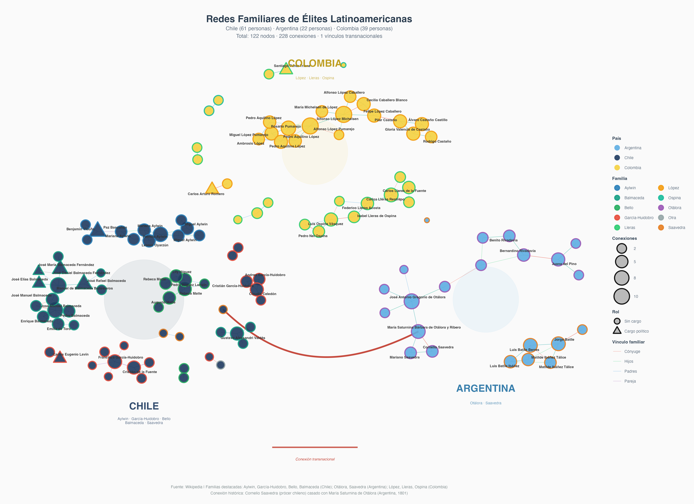

# Redes y Reproducción de Élites Latinoamericanas

> *¿Te sorprendería saber que existe una relación clara entre el Mio Cid Campeador y Vicente Huidobro? ¿O entre Atahualpa y Piñera?*

Este proyecto analiza las **redes familiares y estrategias de reproducción de las élites latinoamericanas** utilizando Wikipedia como fuente de datos. Aplicamos técnicas de análisis de redes sociales y web scraping para mapear las relaciones familiares documentadas en artículos de Wikipedia.

Estamos desarrollando el paquete **familiaRes**, que reúne datos de **múltiples países latinoamericanos** sobre familias de élite y sus conexiones.

---

## 🌎 Visualización Principal



**La red muestra:**
- **6,700+ personas** de familias destacadas de toda Latinoamérica
- **Miles de conexiones familiares** (padres, cónyuges, hijos, hermanos)
- **Vínculos transnacionales** entre países

---

## 📁 Estructura del Proyecto

```
wiki-chile_project/
├── data/                          # Datos del proyecto
│   ├── raw/                       # Datos crudos de scraping por país
│   │   ├── chile/familias/
│   │   ├── argentina/familias/
│   │   ├── colombia/familias/
│   │   ├── venezuela/familias/
│   │   └── .../familias/
│   ├── processed/                 # Datos procesados y consolidados
│   │   └── familias/
│   │       ├── <pais>/consolidado.csv
│   │       └── _CONSOLIDADO_familias_latam.csv
│   └── manual/                    # Datos ingresados manualmente
│
├── scripts/
│   ├── 01_scraping/              # Extracción de Wikipedia
│   │   └── scraper_wikipedia_familias.py
│   ├── 02_processing/            # Limpieza y normalización
│   │   └── run_pipeline.R
│   └── 03_analysis/              # Análisis de redes
│       └── red_familias_multipais_v2.R
│
├── notebooks/                     # Notebooks de scraping por país
│   └── 02_scraping_paises/
│
├── outputs/                       # Resultados finales
│   ├── figures/
│   ├── tables/
│   └── reports/
│
├── WORKFLOW.md                    # 👈 Flujo de trabajo completo
└── README.md                      # Este archivo
```

**📖 Ver [WORKFLOW.md](WORKFLOW.md) para el flujo de trabajo detallado.**

---

## 🚀 Inicio Rápido

### Requisitos previos

- **Python 3.8+**
- **R 4.0+**

### Instalación

```bash
# Clonar el repositorio
git clone https://github.com/matdknu/familiaR-wiki.git
cd wiki-chile_project

# Instalar dependencias Python
pip install -r requirements.txt

# Instalar dependencias R
Rscript -e 'install.packages(c("tidyverse", "ggraph", "tidygraph", "igraph", "viridis", "ggrepel"))'
```

### Uso básico

```bash
# 1. Listar familias disponibles para Chile
python scripts/01_scraping/scraper_wikipedia_familias.py --pais chile --listar

# 2. Scrapear todas las familias de Chile
python scripts/01_scraping/scraper_wikipedia_familias.py --pais chile

# 3. Procesar datos (en R)
Rscript scripts/02_processing/run_pipeline.R

# 4. Generar visualización de redes
Rscript scripts/03_analysis/red_familias_multipais_v2.R
```

---

## 🌎 Países Disponibles

| País | Familias | Personas | Estado |
|------|----------|----------|--------|
| 🇨🇱 Chile | ~100 | ~1,400 | ✅ Completo |
| 🇦🇷 Argentina | ~165 | ~1,200 | ✅ Completo |
| 🇨🇴 Colombia | ~150 | ~1,400 | ✅ Completo |
| 🇻🇪 Venezuela | ~30 | ~280 | ✅ Completo |
| 🇲🇽 México | ~50 | ~500 | ✅ Completo |
| 🇵🇪 Perú | ~30 | ~300 | ✅ Completo |
| 🇪🇨 Ecuador | ~10 | ~200 | ✅ Completo |
| 🇧🇴 Bolivia | ~10 | ~100 | ✅ Completo |
| 🇺🇾 Uruguay | ~15 | ~150 | ✅ Completo |
| 🇵🇾 Paraguay | ~5 | ~50 | ✅ Completo |

**Total LATAM: ~6,700 personas**

---

## 📊 Fuentes de Datos

### 1. Scraping automatizado (Principal)
```bash
python scripts/01_scraping/scraper_wikipedia_familias.py --pais <pais>
```
Extrae automáticamente de las categorías de Wikipedia.

### 2. Notebooks interactivos
```
notebooks/02_scraping_paises/
├── familias-chile.ipynb
├── familias-argentina_general.ipynb
├── familias-colombia.ipynb
└── ...
```
Para scraping personalizado y debugging.

### 3. Datos manuales
```
data/manual/
├── familia_tovar_venezuela_manual.csv
└── familias_extra_<pais>.csv
```
Para agregar familias no disponibles en Wikipedia.

**Ver [data/manual/README.md](data/manual/README.md) para más detalles.**

---

## 📈 Análisis Disponibles

| Script | Descripción | Salida |
|--------|-------------|--------|
| `red_familias_multipais_v2.R` | Red multi-país con clusters | `red_familias_latam.png` |
| `red_general_todos.R` | Red general completa | `red_general_todos.png` |
| `analisis_endogamia_politica_multipais.R` | Análisis de endogamia | Tablas y gráficos |
| `cambio_elites_1973.R` | Cambio de élites post-1973 | Análisis temporal |
| `red_chile_argentina.R` | Redes transnacionales | Redes binacionales |

---

## 📝 Datos Procesados

Los datos consolidados incluyen para cada persona:

| Campo | Descripción |
|-------|-------------|
| nombre | Nombre completo |
| url | URL de Wikipedia |
| biografia | Texto biográfico |
| fecha_nacimiento | Fecha de nacimiento |
| nacionalidad | Nacionalidad |
| ocupacion | Ocupación principal |
| padres | Nombres de padres |
| conyuge | Cónyuge(s) |
| hijos | Hijos |
| familia | Familia a la que pertenece |
| cargos_politicos | Cargos políticos |
| infobox_json | Datos estructurados |

---

## 📚 Referencias

- Padgett, J. F., & Ansell, C. K. (1993). Robust Action and the Rise of the Medici, 1400-1434. *American Journal of Sociology*, 98(6), 1259-1319.

---

## 🤝 Contribuciones

1. Crear una rama: `git checkout -b feature/nueva-funcionalidad`
2. Hacer commit: `git commit -m "Descripción"`
3. Push: `git push origin feature/nueva-funcionalidad`
4. Crear Pull Request

---

## 📧 Contacto

Para preguntas o sugerencias, abrir un issue en el repositorio.

---

## 📄 Licencia

MIT License - Ver archivo LICENSE para más detalles.
