## 

## 

## Me

{fig-align="center" width="34%"}

**Matías Deneken**\
Pontificia Universidad Católica de Chile

GitHub: [\@matdknu](https://github.com/matdknu)\
Email: [m.deneken\@uc.cl](mailto:m.deneken@uc.cl)

------------------------------------------------------------------------

## Main Research Question {.question-slide}

::: question-wrap
::: question-main
Do elite family networks structure political power reproduction in Latin
America — and can we measure this at scale?
:::

::: question-sub
A computational-text analysis of a collectively authored biographical
archive (Spanish-language Wikipedia).
:::
:::

------------------------------------------------------------------------

## Allende–Pascal Hook

------------------------------------------------------------------------

## Surnames as Elite Markers?

::: columns
::: {.column width="56%"}
**The sociological claim:** Surnames function as social capital
certificates — encoding lineage, alliances, and institutional access
across generations.

-   **Balmori, Voss & Wortman (1984):** *familias notables* as unit of
    analysis
-   **Bourdieu (1996):** social reproduction through symbolic capital
-   **Centeno (2002):** elite networks and state formation
:::

::: {.column width="44%"}
**The computational opportunity**

Wikipedia infoboxes encode kinship at scale:

-   **6,711** individuals
-   **8,201** matched kinship edges
-   **10** republics, one pipeline

::: {style="margin-top:0.8em; font-size:0.72em; color:#666;"}
*A documentary elite field — not the social elite itself.*
:::
:::
:::

------------------------------------------------------------------------

## Data & Pipeline

::: columns
::: {.column width="52%"}
**Source**

Spanish-language Wikipedia (`es.wikipedia.org`) as a collectively
authored biographical archive.

**Extraction targets**

-   Kinship: `conyuge`, `pareja`, `padres`, `hijos`, `hermanos`
-   Institutional: `partido_politico`, `educacion`
-   Succession: `predecesor`, `sucesor`

**Entity resolution**

Internal hyperlinks — not string matching — resolve mentioned relatives
to scraped biographies.
:::

::: {.column width="48%"}
::: box-primary
**Corpus (10 republics)**\
ARG · BOL · CHL · COL · ECU · MEX · PRY · PER · URY · VEN

**6,711** individuals after deduplication\
**8,201** matched kinship edges\
**92.9%** with parsed birth year\
**743** families (SBM unit of analysis)
:::
:::
:::

------------------------------------------------------------------------

## Two Conceptual Distinctions

::: box-primary
**1) Closure–reach trade-off**

Families that maximize endogamy sacrifice bridging ties. Families that
maximize transnational reach usually display lower endogamy. These are
alternative strategies, not complementary ones.
:::

::: box-primary
**2) Documentary elite field**

Wikipedia captures the stratum that successfully inscribed itself in
public digital archives. Its boundaries are analytically substantive,
not merely a nuisance.
:::

------------------------------------------------------------------------

## Five Hypotheses

|        | Hypothesis                                        | Mechanism                                                     |
|--------------|--------------------------|--------------------------------|
| **H1** | Family closure ↔ political concentration          | Marriage market as political institution                      |
| **H2** | Network topology ↔ regime type                    | Chain = patrimonial; Star = founding lineage; Web = oligarchy |
| **H3** | Transnational ties follow Pacific–Andean corridor | Colonial administrative geography                             |
| **H4** | Betweenness centrality = structural brokerage     | Multiplex positioning across kinship + institutions           |
| **H5** | Core–periphery architecture with robust brokers   | Convergence across six complementary methods                  |

: {tbl-colwidths="\[8,46,46\]"}

------------------------------------------------------------------------

## Methods at a glance

| Method                  | Question                               | Graph layer        |
|---------------------|---------------------------------|------------------|
| ERGM                    | Is tie formation structured or random? | Family–family      |
| SBM                     | Is there mesoscopic structure?         | Family–family      |
| Homophily + permutation | How do attributes sort?                | Node attributes    |
| Cohort analysis         | Did structure change historically?     | Temporal subgraphs |
| Targeted attack         | Is the graph fragile?                  | Connectivity       |
| Gould–Fernandez         | What brokerage roles exist?            | Paths over blocks  |

::: box-primary
Six methods, one graph — convergence is the epistemic claim.
:::

------------------------------------------------------------------------

## Wikipedia: Data source

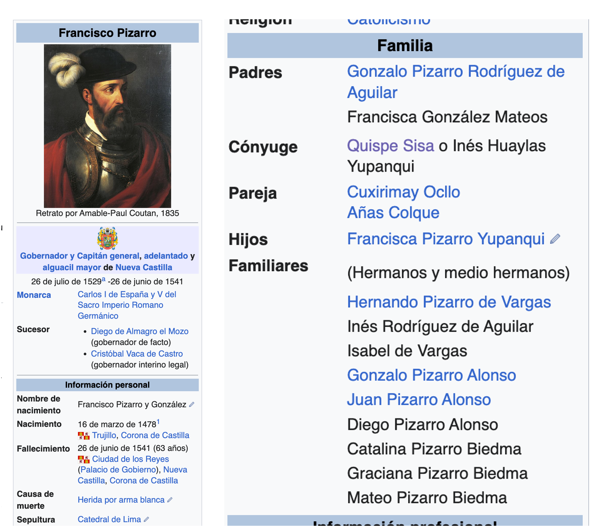{fig-align="center" width="78%"}

------------------------------------------------------------------------

## Initial findings

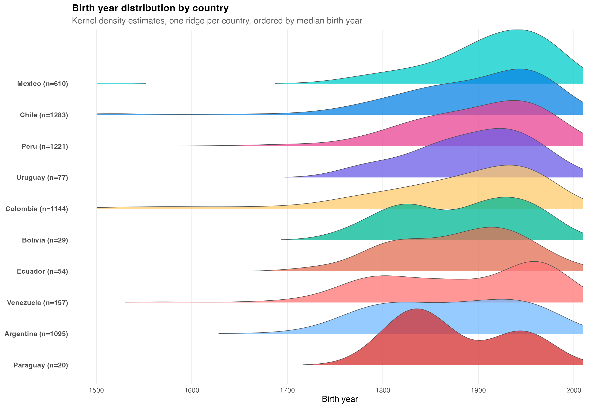{.r-stretch
fig-align="center"}

::: {style="font-size:0.62em; color:#60748e; text-align:center;"}
Birth-year distributions by country (kernel density ridges).
:::

------------------------------------------------------------------------

## H1: Endogamy Rates by Country

::: columns
::: {.column width="56%"}
| Country   | Marriages | Endogamy rate | Transnational rate |
|-----------|-----------|---------------|--------------------|
| Paraguay  | 4         | **1.000**     | 0.000              |
| Ecuador   | 10        | 0.900         | 0.200              |
| Mexico    | 108       | 0.870         | 0.139              |
| Argentina | 177       | 0.864         | 0.203              |
| Venezuela | 25        | 0.840         | 0.200              |
| Chile     | 251       | 0.837         | 0.092              |
| Colombia  | 151       | 0.795         | 0.086              |
| Uruguay   | 18        | 0.778         | **0.389**          |
| Peru      | 104       | 0.769         | 0.115              |
| Bolivia   | 3         | 0.667         | 0.667              |
:::

::: {.column width="44%"}
**Reading**

-   Endogamy differs sharply across countries.
-   Larger political fields tend to show lower closure.
-   Uruguay is an outlier in transnational marriage share.
-   Paraguay reaches maximum closure in a very small corpus.
:::
:::

------------------------------------------------------------------------

## H1: National Kinship Layouts (Facets)

{.r-stretch fig-align="center"}

::: {style="font-size:0.56em; color:#60748e; text-align:center;"}
Exploratory faceted layouts by country (Fruchterman–Reingold).
:::

------------------------------------------------------------------------

## H2: Chilean elite

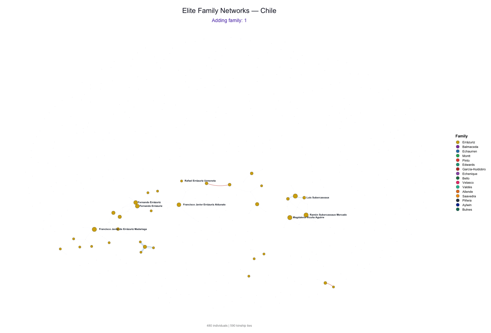{fig-align="center"}

## H2: Argentinian elite

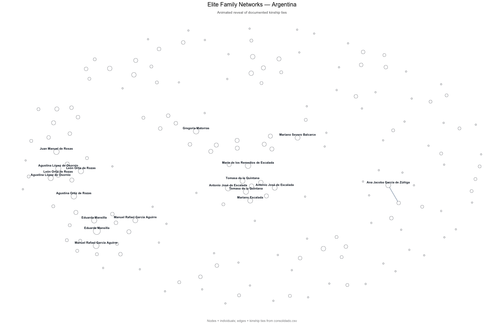{fig-align="center"}

## H3: Mexican elite

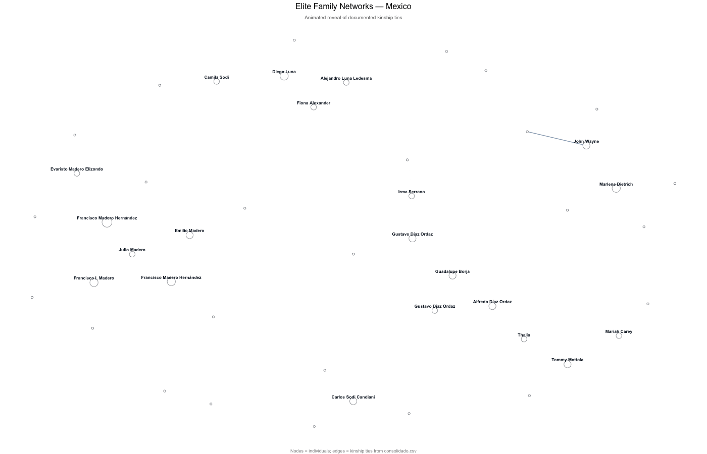{fig-align="center"}

## H3: Transnational Network + Flow Maps

::: columns
::: {.column width="52%"}
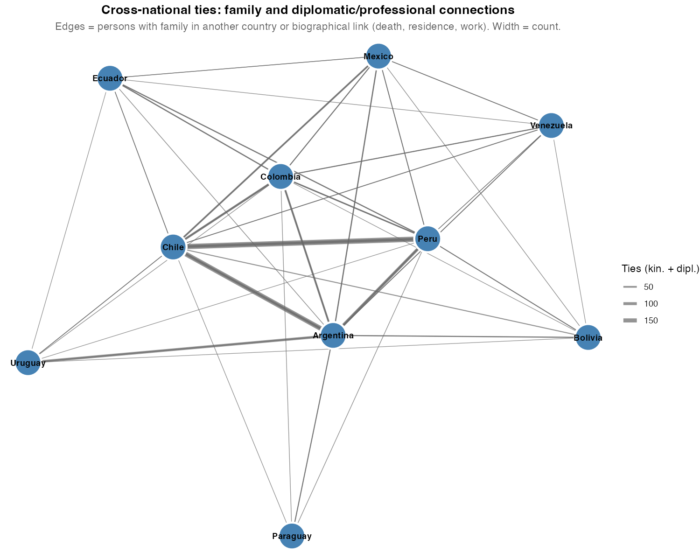{fig-align="center"
width="100%"}

::: {style="font-size:0.5em; color:#60748e; text-align:center;"}
Cross-border ties in the pooled transnational network.
:::
:::

::: {.column width="48%"}
{fig-align="center"}

::: {style="font-size:0.5em; color:#60748e; text-align:center;"}
Flow map pooled across all birth cohorts.
:::
:::
:::

------------------------------------------------------------------------

## H3: Flow Map (Schematic) + Bipartite Example

::: columns
::: {.column width="52%"}
{fig-align="center"}

::: {style="font-size:0.5em; color:#60748e; text-align:center;"}
Cross-border ties in the pooled transnational network.
:::
:::

::: {.column width="48%"}
{fig-align="center"}

::: {style="font-size:0.5em; color:#60748e; text-align:center;"}
Flow map pooled across all birth cohorts.
:::
:::
:::

------------------------------------------------------------------------

## H4: Who Are the Brokers?

::: columns
::: {.column width="56%"}
| Name                  | Country   | Betweenness |
|-----------------------|-----------|-------------|
| Luis Felipe Villaran  | Peru      | 517,714     |
| Walter Humala         | Peru      | 473,134     |
| Luis Jaime Cisneros   | Peru      | 391,641     |
| Jose Evaristo Uriburu | Argentina | 328,970     |
| Pastor Obligado       | Argentina | 267,974     |
| Guido Di Tella        | Argentina | 240,510     |
| Cuauhtemoc Cardenas   | Mexico    | 198,005     |
| Roque Saenz Pena      | Argentina | 168,155     |
:::

::: {.column width="44%"}
**Interpretation**

-   Peru and Argentina dominate top brokerage positions.
-   Multiplex brokerage captures institutional pathways, not only
    kinship proximity.
-   These are plausible structural coordinators, not causal estimates of
    influence.
:::
:::

------------------------------------------------------------------------

## H4: Centrality vs Closure (Multiplex)

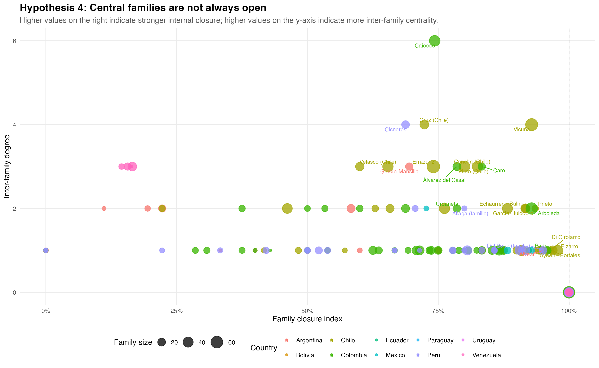{.r-stretch
fig-align="center"}

------------------------------------------------------------------------

## H5.1 SBM — The Hidden Core

::: columns
::: {.column width="50%"}
::: box-primary
-   **K = 2 blocks selected by ICL**
-   **Block 1: 722 families, pi = 0.00066**
-   **Block 2: 21 families, pi = 0.138**
-   **Ratio 208:1 — this is not two rival coalitions**
-   **This is a core and a periphery**
:::
:::

::: {.column width="50%"}
::: box-primary
-   **16 of 21 core families are Chilean**
-   **4 Colombian (Acevedo, Caicedo, Eder, Obregon)**
-   **1 Mexican (Pinal Hidalgo)**
-   **Zero from Argentina, Peru, Venezuela, Paraguay**
:::

::: {style="font-size:0.7em; color:#60748e;"}
Peru contributes the largest national sub-corpus (185 families).
Sub-corpus size does not predict core membership — structural position
does.
:::
:::
:::

::: box-highlight
The core is not where we expected to find it.
:::

------------------------------------------------------------------------

## H5.2 · Temporal Consolidation

### Five cohorts, one trajectory

::: columns
::: {.column width="55%"}
| Cohort                   | Edges | Cross-family share | Cross-country share |
|--------------------------|------:|-------------------:|--------------------:|
| Colonial (pre-1800)      | 1,658 |          **17.7%** |                8.6% |
| Independence (1800–1850) | 1,714 |               9.9% |                4.2% |
| Oligarchic (1850–1900)   | 1,556 |               6.7% |                3.0% |
| Republican (1900–1950)   | 2,366 |               5.5% |                4.3% |
| Modern (1950–2000)       |   868 |           **5.3%** |                4.7% |

::: {style="font-size:0.7em; color:#60748e; margin-top:0.4em;"}
Cross-family share = proportion of edges linking distinct surname
clusters. Cross-country share = proportion of edges crossing national
borders. Modern cohort edge count partially reflects right-censoring.
:::
:::

::: {.column width="45%"}
**Two numbers tell the story**

::: {style="background:#f7f9fc; padding:0.7em 1em; border-radius:6px; margin-top:0.3em;"}
Cross-family share:

**17.7% → 5.3%**

A **70% decline** across five successive cohorts
:::

::: {style="font-size:0.85em; margin-top:0.7em;"}
Meanwhile, total edge volume *rises* from 1,658 (Colonial) to 2,366
(Republican) before the censored Modern drop-off.
:::

::: box-primary
More ties. Fewer lineages.
:::
:::
:::

::: {style="font-size:0.75em; color:#60748e; margin-top:0.6em; text-align:center;"}
The network does not shrink. It becomes **self-referential**.
:::

------------------------------------------------------------------------

## H5.2 · Temporal Consolidation

### The signature of oligarchic consolidation

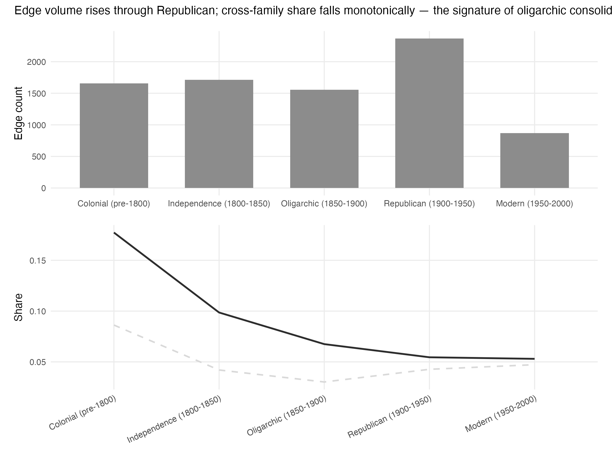{.r-stretch fig-align="center"}

::: {style="font-size:0.5em; color:#60748e; text-align:center; margin-top:0.3em;"}
Cross-family tie share (y-axis) plotted across five birth-year cohorts.
Monotonic decline coincides with the nineteenth-century state-building
period Centeno (2002) identifies as foundational for Latin American
republics.
:::

::: columns
::: {.column width="50%"}
::: box-primary
**The empirical signature**

Kinship intensification *substitutes* for fiscal-military
institution-building
:::
:::

::: {.column width="50%"}
::: {style="background:#fef3e6; border-left:4px solid #b8651a; padding:0.6em 0.9em; border-radius:4px; font-size:0.85em;"}
**Centeno (2002):** Latin American states did not fight the mass wars
that forced fiscal-military transformation in Europe.

They produced **"states without wars"** — sustained by elite network
coordination.
:::
:::
:::

------------------------------------------------------------------------

## H5.3 · Network Fragility

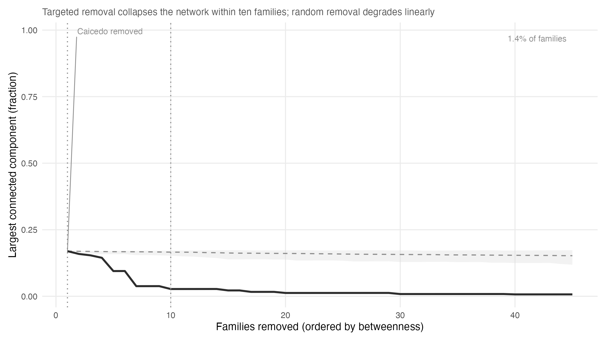{.r-stretch fig-align="center"}

## H5.4 · Robust Brokers

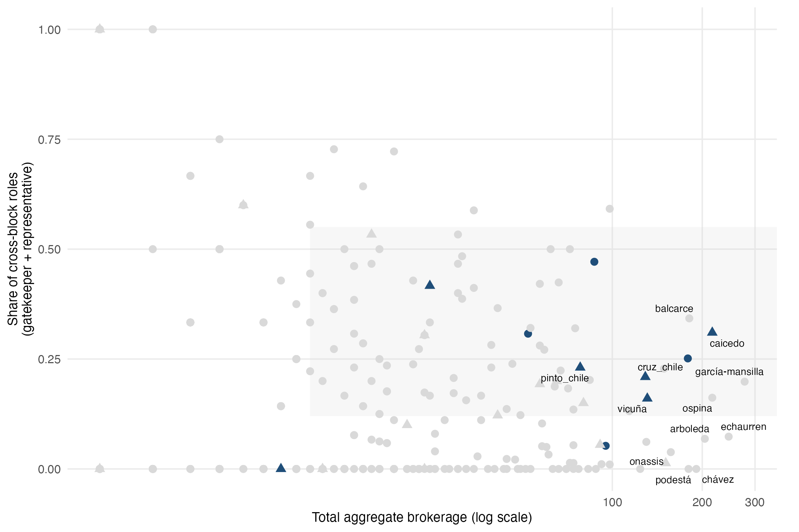{.r-stretch fig-align="center"}

## Competing Explanations

::: {style="font-size:0.74em; line-height:1.28;"}
::: columns
::: {.column width="56%"}
::: {style="background:#f4f6ff; border-left:4px solid #5431b2; padding:0.55em 0.9em; border-radius:6px; margin-bottom:0.45em; text-align:left;"}
**1) Visibility bias:** Are central families merely more famous in
Wikipedia?
:::
:::

::: {.column width="44%"}
:::
:::

::: columns
::: {.column width="22%"}
:::

::: {.column width="78%"}
::: {style="display:flex; justify-content:flex-end; width:100%; padding-right:0.15em;"}
::: {style="background:#fdf8f2; border-right:4px solid #b8651a; padding:0.55em 0.85em 0.55em 1.15em; border-radius:6px; margin-bottom:0.45em; text-align:right; max-width: 92%;"}
**2) Demography:** Do larger countries mechanically generate denser
graphs?
:::
:::
:::
:::

::: columns
::: {.column width="56%"}
::: {style="background:#f4f6ff; border-left:4px solid #5431b2; padding:0.55em 0.9em; border-radius:6px; margin-bottom:0.45em; text-align:left;"}
**3) Random formation:** Could observed structures emerge from sparse
random baselines?
:::
:::

::: {.column width="44%"}
:::
:::

::: columns
::: {.column width="22%"}
:::

::: {.column width="78%"}
::: {style="display:flex; justify-content:flex-end; width:100%; padding-right:0.15em;"}
::: {style="background:#fdf8f2; border-right:4px solid #b8651a; padding:0.55em 0.85em 0.55em 1.15em; border-radius:6px; text-align:right; max-width: 92%;"}
**4) Detection artifact:** Is core–periphery a byproduct of model
choice?
:::
:::
:::
:::
:::

------------------------------------------------------------------------

## Limitations

::: box-primary
**1) Visibility bias**: Wikipedia disproportionately documents literate,
urban, politically visible individuals. Indigenous, Afro-descendant, and
subnational elites are underrepresented.
:::

::: box-highlight
**2) Kinship incompleteness**: 42.2% of infobox-declared ties do not
resolve to a second scraped biography. Per-country matching rates have
not yet been diagnosed — priority work for next iteration.
:::

::: box-primary
**3) Label uncertainty**: `familia_norm` may merge distinct lineages
(common surname) or split unified ones (orthographic variation across
borders).
:::

::: box-highlight
**4) No causal identification**: Network position measures covary with
regime characteristics. They do not establish that kinship architecture
causes political order — only that the two are structurally entangled in
the documentary record.
:::

------------------------------------------------------------------------

## Toward Causal Identification

::: {style="font-size:0.76em;"}
**1) Cohort designs** with birth-year slicing to test historical timing
of closure and brokerage.

**2) Shock-based comparisons** (e.g., War of the Pacific) for structured
pre/post contrasts.

**3) Spatial constraints** as quasi-instruments for corridor intensity.
:::

------------------------------------------------------------------------

## Broader Implications

::: box-primary
**Democracy:** Where closure and institutional concentration coincide,
accountability faces a structural obstacle.
:::

::: box-primary
**Computational social science:** Large-scale computational
prosopography is feasible with public digital traces.
:::

::: box-highlight
**Public archives:** Open genealogical data can increase both
transparency and elite salience.
:::

------------------------------------------------------------------------

## Summary

...

## Package + Future Implications

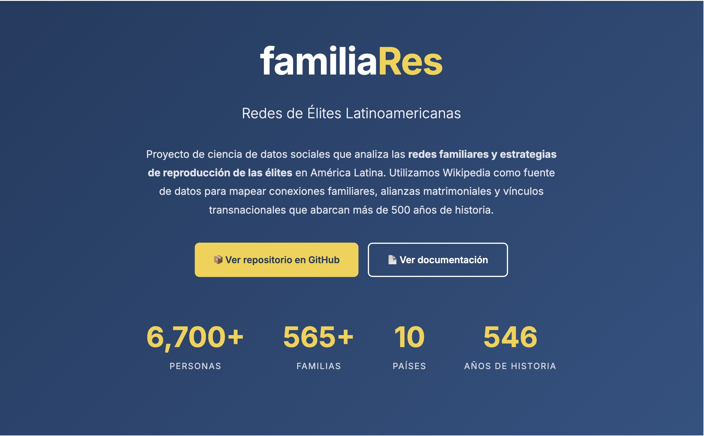{fig-align="center" width="76%"}

::: {style="font-size:0.7em; color:#60748e; text-align:center;"}
-   JSON exports for reproducibility and interoperability\
-   LLM-assisted annotation for exploratory coding support\
-   Open-access release for teaching and replication
:::

------------------------------------------------------------------------

##  {#thank-you-slide}

::: thank-you-content
### Thank you!

**Elite Family Networks in Latin America**

*Evidence from Wikipedia Genealogical Data*

**Matías Deneken**

*Incoming PhD, LSE*

[m.deneken\@uc.cl](mailto:m.deneken@uc.cl){.email-link}

[GitHub: \@matdknu](https://github.com/matdknu){.github-link}
:::
