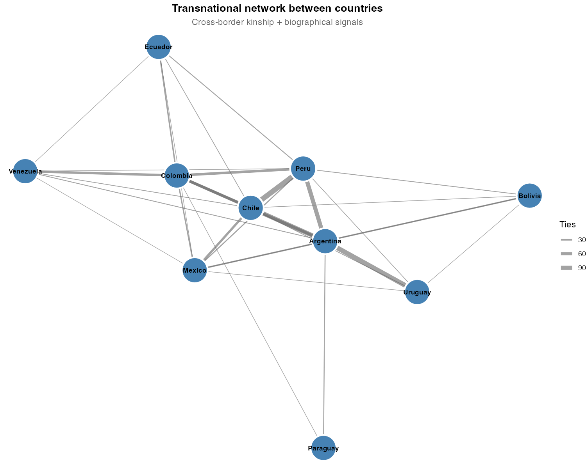
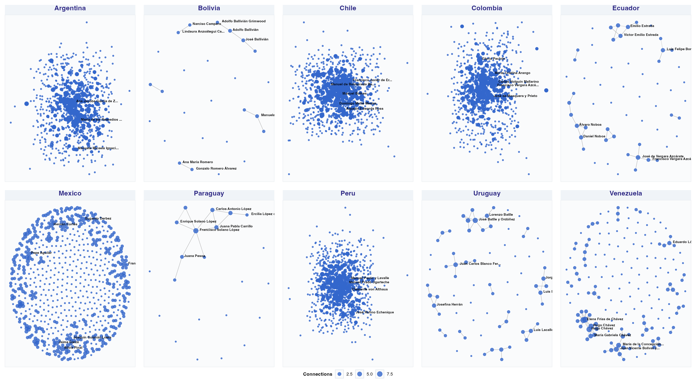
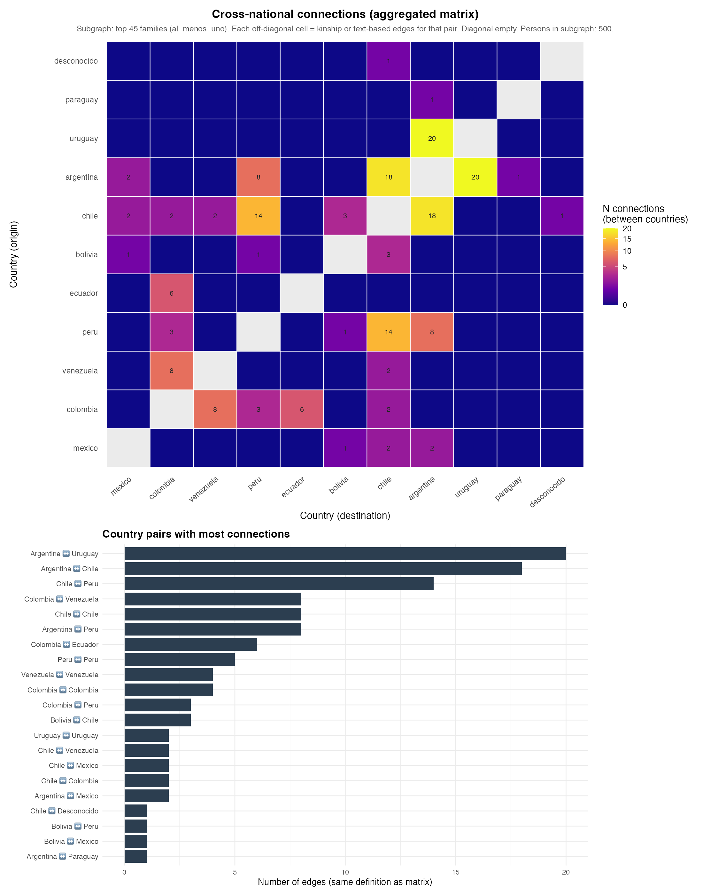
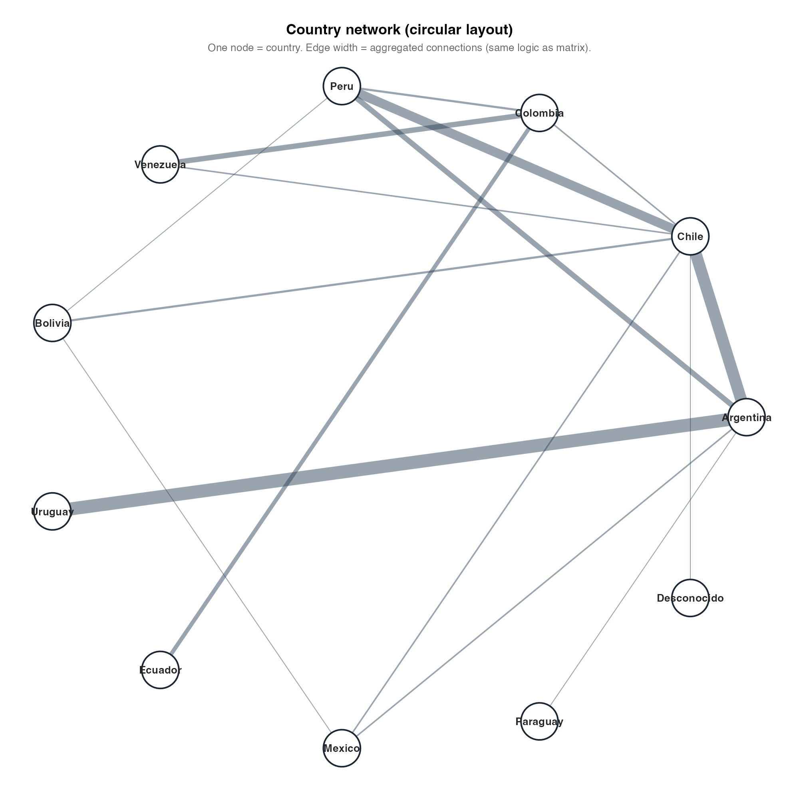
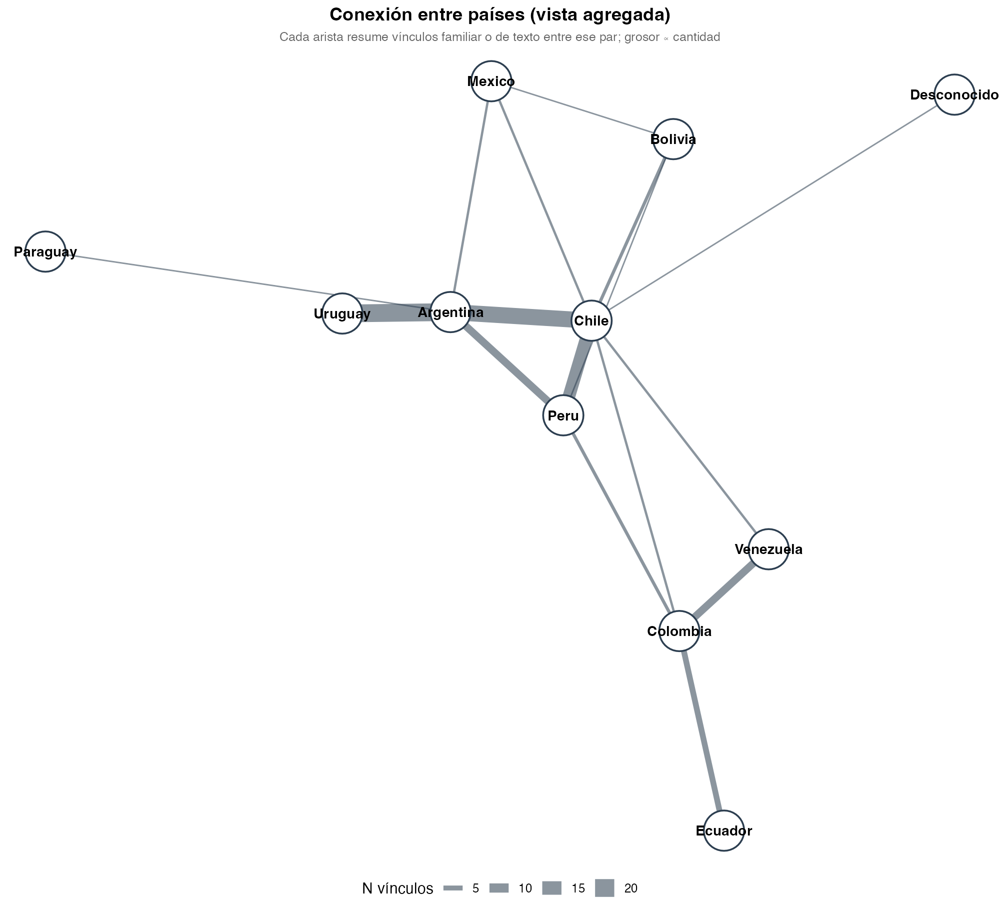

# Abstract

How do elite family networks structure the reproduction of political power in Latin America across the long nineteenth to twenty-first centuries? Using genealogical data scraped from Spanish-language Wikipedia for approximately 6,700 notable individuals across ten countries, we construct kinship networks based on spouse, parent–child, and partner ties (approximately 8,200 matched edges between identified individuals). We combine network topology measures—degree, betweenness, PageRank, and Louvain community detection—with country-level aggregates of endogamy, transnational reach, and dynasty persistence. Descriptive and correlational analyses speak to four hypotheses: (H1) family closure covaries with political concentration; (H2) macro-scale network topology (chain, star, web, fragment) aligns with stylized regime types; (H3) transnational family ties follow Pacific–Andean rather than Atlantic corridors in the aggregate; (H4) betweenness centrality identifies individuals in structural brokerage positions potentially relevant to cross-national influence. We find substantial heterogeneity across republics: Paraguay exhibits a near-linear dynastic chain consistent with patrimonial consolidation; Chile and Peru show star-like structures around prominent lineages; Argentina, Colombia, and Mexico display dense webs suggestive of competitive oligarchy; Bolivia, Venezuela, and Ecuador show fragmentation consistent with regionalized elite politics. The strongest cross-national kinship weights link Chile–Peru, Chile–Argentina, and Peru–Bolivia. Women frequently register high genealogical degree yet lower betweenness than men in institutional tie projections, consistent with marriage-mediated alliance and under-documentation in public office networks. We emphasize that Wikipedia encodes a *documentary* elite biased toward literate, nationally visible strata. Causal claims are hedged throughout; findings are best interpreted as structured description of a collective digital archive rather than as an exhaustive map of Latin American elites.

**Keywords:** elite networks; Latin America; family; political reproduction; Wikipedia; social network analysis

\newpage

# Introduction

Latin American political history has long been interpreted through the lens of oligarchy, caudillismo, and the intergenerational transmission of status (Mahoney, 2010; Centeno, 2002). Classical elite theory—from Pareto and Mosca through mid-twentieth-century political sociology—stressed circulation versus closure: whether ruling strata renew themselves through co-optation and alliance or seal themselves behind kinship and class barriers. Empirical adjudication at scale, however, has remained difficult. Systematic, comparable evidence on *how* elite families connect across countries and centuries is scarce because prosopographical reconstruction is labor-intensive and rarely harmonized across national archives.

Historical sociology and political sociology nevertheless offer rich idiographic traditions. Padgett and Ansell’s (1993) analysis of Florentine marriage and banking ties showed how multiplex network structure could sustain “robust action” under factional rivalry. Regional studies of Latin American *familias notables* documented marriage strategies linking land, office, and credit (Balmori, Voss, & Wortman, 1984). Scaling such insights to multiple republics typically required either heroic archival work or illustrative genealogies whose representativeness is uncertain.

Digital traces offer a complementary path. Spanish-language Wikipedia aggregates biographical entries produced by dispersed editors; kinship statements—spouses, parents, children, partners—are often included in infoboxes or narrative leads. These data are neither representative of whole populations nor free of bias: they disproportionately document literate, urban, politically and culturally visible individuals. Yet precisely that bias may approximate what successive generations of national publics chose to record about “notable” families—a *documentary elite* whose network properties are sociologically interesting in their own right (Lazer et al., 2014). The task is not to confuse Wikipedia with society, but to analyze the structure of a large, public, repeatedly edited genealogical corpus.

This paper asks: **How have elite family networks structured the reproduction of political power in Latin America from roughly the nineteenth through the twenty-first centuries?** We articulate four hypotheses (H1–H4) linking (i) marriage closure to political concentration, (ii) macro-scale graph topology to stylized regime types, (iii) transnational kinship geography to colonial-era corridors, and (iv) betweenness centrality to brokerage positions potentially associated with cross-national salience. Our contribution is threefold. First, we provide a **multi-country, comparable kinship graph** built under documented extraction rules from a single digital source, enabling cross-national juxtaposition rarely feasible with archival prosopography alone. Second, we **map heterogeneity** across states—rejecting a single “Latin American elite model”—by relating stylized network forms (chain, star, web, fragment) to diverse national histories. Third, we **foreground gender and documentation asymmetry**: women often appear as high-degree connectors in pure kinship projections while exhibiting lower betweenness when ties are weighted toward publicly documented roles, a pattern we link cautiously to marriage as alliance and to women’s historical exclusion from formal high office.

The remainder proceeds as follows. Section 2 reviews relevant literature on Latin American elites, social reproduction, and network analysis. Section 3 describes data construction, variables, and limitations. Section 4 presents results by hypothesis. Section 5 discusses interpretation, scope conditions, and research ethics. Section 6 concludes.

# Literature Review

## Notable families, oligarchy, and the state

Classic scholarship on Latin America emphasized the *familia notable* as a unit linking land, urban property, marriage, and access to state office (Balmori et al., 1984). Centeno (2002) connected elite networks to war-making and the fiscal–military organization of republics; Mahoney (2010) emphasized path dependence in colonial and postcolonial institutions. These works imply testable expectations at the network level: **family strategies**—endogamy, strategic exogamy, and placement of kin in parties and ministries—should covary with how concentrated political access is and how durable elite coalitions prove over time.

Bourdieu’s (1996) analysis of the French state nobility supplies a vocabulary for **social reproduction**: elites convert economic resources into social ties and cultural credentials, then monopolize institutional positions across generations. Latin American contexts differ—Catholic Church, army, export agriculture, mining enclaves—but the *problem* of stabilizing advantage through kinship remains analogous. Where elites successfully restrict marriage markets, one expects measurable **closure** at the level of surname clusters (H1). Where party systems fragment elite access, closure may remain moderate even as network density rises.

## Network topology and political orders

Historical network analysis demonstrates that **macro-structure**—chains, stars, dense cores, or disconnected fragments—can correspond to distinct modes of coordination and conflict (Padgett & Ansell, 1993). Granovetter (1973) motivated attention to weak ties and brokers bridging clusters. Translating these ideas to Latin America requires caution: one may *loosely* associate linear dynastic chains with personalist or patrimonial consolidation (Weber’s patrimonialism as ideal type), star-like graphs with a legitimating “founding” lineage, dense webs with competitive oligarchy and multiple channels of access, and fragmented graphs with regionalized or weakly integrated national elites. Such mappings are **stylized ideal-types** for interpretation, not operational codes inferred mechanically from graph metrics (H2).

## Empire, corridor, and transnational elites

Colonial geography—mining belts, highland–coastal links, viceregal capitals—may channel later elite mobility and marriage. Pacific Andean spaces and Chilean–Peruvian histories of war and diplomacy plausibly leave **residual structure** in cross-border kinship long after independence. If transnational kinship edges in a Wikipedia-derived graph concentrate along a Pacific–Andean corridor rather than dispersing uniformly, that pattern offers descriptive support for **path-dependent geography** (H3)—not proof of a colonial causal mechanism, but consistency with historically informed priors.

## Gender, marriage, and visibility

Colonial and republican marriage regimes structured women’s positions as alliance partners and transmitters of property and status (Lavrin, 1990). If encyclopedic records disproportionately document women through ties to notable husbands and sons, **degree** in a kin-only graph may overstate public-political centrality while **betweenness** on office-weighted projections remains low. We treat gendered splits between degree and betweenness as **hypothesis-generating** evidence about brokerage and exclusion, not as definitive proof of mechanisms.

# Data and Methods

## Source and population

We scraped Spanish-language Wikipedia biographical pages for ten Latin American countries (Argentina, Bolivia, Chile, Colombia, Ecuador, Mexico, Paraguay, Peru, Uruguay, Venezuela—aligned with the project pipeline). The working dataset contains approximately **6,700** person-records with parsed infobox fields, biographical text, and extracted kinship relations. Edges represent **spouse (*cónyuge*)**, **parent–child (*padre/madre*, *hijo/a*)**, and **unmarried partner (*pareja*)** where stated. After entity resolution against an internal person table, **8,201** edges link two identified individuals (`persona_id`); additional records attach to unmatched text strings and are retained for sensitivity analyses but excluded from the main matched-edge graph.

**Family** is operationalized via **`familia_norm`**, a normalized surname cluster produced by the processing pipeline (orthographic merging). This is a *Wikipedia-family label*, not a validated genealogical house; homonymy and splitting errors are acknowledged.

**Country** attaches to individuals using multiple signals (nationality fields, infobox, text-based detection, imputation rules documented elsewhere); manual corrections (`url_pais_extra.csv`) address known misassignments. A kinship edge is treated as **transnational** for aggregation when endpoint countries differ under these assignments.

## Network construction and metrics

We construct an undirected graph $G=(V,E)$ on matched edges. For national subgraphs and the pooled graph we compute:

- **Degree** (and strength where weights are used in extensions).
- **Betweenness centrality** (normalized in exported tables).
- **PageRank** (robustness checks).
- **Clustering coefficients** (local/global as reported).
- **Louvain community detection** for modularity-based partitions (`metricas_centralidad.csv`, `comunidades_detectadas.csv`).

**Endogamy:** On marriage-type edges only, a tie is **endogamous** if both endpoints share the same `familia_norm`. Country summaries appear in `endogamia_por_pais.csv`.

**Transnational structure:** Country-pair aggregates appear in `transnacional_red_paises.csv` and `conexiones_familiares_entre_paises.csv`. **Dynasty persistence** is summarized in `dinastias_persistencia.csv` (temporal span of families).

**Political linkage:** Party–family mappings and concentration measures appear in `instituciones_partidos.csv` and `instituciones_concentracion_partidos.csv`. Hypothesis-oriented country summaries are pre-computed in `h1_h4_resumen_pais.csv`. We treat these as **descriptive covariation** aligned with H1–H4, not as estimated structural-equation coefficients.

## Analytical stance

All main analyses are **observational**. Network metrics describe co-occurrence in a digital corpus conditioned on notability and editorial practice. We eschew causal language except when clearly marked as speculative. Language throughout Results follows a **hedging norm**: “associated with,” “consistent with,” “suggestive.”

## Temporal scope

Biographical dates span roughly **1800–2000** with colonial antecedents for some lineages. Coverage is uneven: twentieth- and twenty-first-century figures are over-represented relative to nineteenth-century notables. Unless we split cohorts explicitly, long-run graphs **conflate** periods; conclusions are therefore strongest at the **cross-national comparative** level rather than for fine-grained periodization.

## Limitations (explicit)

1. **Selection bias:** Wikipedia encodes literate, visible, often male elites; indigenous, Afro-descendant, and subnational elites are systematically underrepresented.
2. **Kinship incompleteness:** Editors omit relatives; women may appear chiefly as spouses or mothers.
3. **Label noise:** `familia_norm` may merge or split lineages incorrectly, especially across countries.
4. **Temporal conflation:** Unless disaggregated, graphs pool republican and colonial-era ties.
5. **No causal identification:** Betweenness or endogamy cannot be interpreted as manipulable “treatments” without additional design.

# Results

We organize results by hypothesis. **Table 1** (assemble from `metricas_centralidad.csv` and `h1_h4_resumen_pais.csv`) should report nodes, edges, mean degree, clustering, modularity, and endogamy by country. **Table 2** lists top transnational families by geographic reach. **Table 3** lists top betweenness individuals (`metricas_centralidad.csv`). **Table 4** ranks country-pairs by cross-border edge weight. **Figures 1–4** correspond to faceted national networks, transnational aggregation (heatmap or circle layout), betweenness bars, and family reach charts—paths under `outputs/figures/` in the replication repository.

## H1: Family closure and political concentration

Endogamy rates vary markedly across countries (`endogamia_por_pais.csv`). Qualitatively, jurisdictions with **higher marriage closure** among Wikipedia-notable families often appear alongside **more concentrated party–family mappings** in `instituciones_concentracion_partidos.csv` and summary rows in `h1_h4_resumen_pais.csv`. The association is **not uniform**: some competitive oligarchies combine dense webs with moderate endogamy. **H1 receives partial descriptive support:** closure and concentration move together in several cases, but institutions and party-system form plausibly mediate the relationship. A formal regression of concentration on endogamy with country fixed effects would be a natural next step (not reported here).

## H2: Topology and stylized regime types

Exploratory visualization and community structure suggest **ideal-typical alignments** (interpretive, not algorithmically assigned):

- **Paraguay:** A near-**linear chain** around the López dynasty, evocative of **patrimonial** consolidation and long-run personalist rule in Weberian terms.
- **Chile and Peru:** **Star-like** patterns with prominent hubs (including Balmaceda-centered structures in exploratory plots), consistent with centralized elite coordination and founding-lineage legitimacy narratives.
- **Argentina, Colombia, Mexico:** **Dense webs** with multiple high-degree nodes—consistent with **competitive oligarchy** and plural channels of elite access.
- **Bolivia, Venezuela, Ecuador:** **Fragmentation** into smaller cohesive clusters—consistent with regionalized or less integrated national elite fields.

**H2 is supported descriptively** at the level of stylized analogy. We do not estimate predictive models from topology to regime type.

## H3: Transnational corridors

Aggregated kinship weights rank **Chile–Peru** highest, followed by **Chile–Argentina** and **Peru–Bolivia**. Atlantic-oriented pairs (e.g., Argentina–Brazil) are weaker in this slice. **H3 receives descriptive support** for a **Pacific–Andean corridor** in Wikipedia-documented elite kinship. Mechanisms—mining, education, diplomacy—are not identified here.

At the family level, **Toro** and **Palacios** (Venezuela) show exceptional geographic breadth; **Bolívar** and **Pizarro** anchor symbolic colonial lineages with wide reach. Country-pair aggregates and family-level reach are complementary, not redundant, layers of evidence.

## H4: Betweenness and brokerage

High betweenness is concentrated among a small set of individuals—e.g., **Luis Felipe Villarán**, **Walter Humala** (Peru), **José Evaristo Uriburu** (Argentina)—with Peru and Argentina contributing disproportionately to brokerage scores in this corpus. **H4 is descriptively supported:** structural brokerage positions are identifiable. We refrain from equating betweenness with “influence” outside the documented network; the measure captures **potential** bridging under the kinship projection used.

## Gender patterns

Women often combine **high degree** in kin-only projections with **lower betweenness** than men in comparable tables—consistent with genealogical centrality through marriage and under-representation in office-centric tie definitions (Argentina, Colombia as qualitative illustrations). This pattern is **hypothesis-generating** for feminist and historical scholarship; definitive tests require richer biographical databases.

# Discussion

## Heterogeneity versus a single Latin American model

Our results align with a **heterogeneous Latin America** thesis: elite kinship topologies are not isomorphic. Contrasting Paraguayan chain-like structures with Mexican or Colombian density resonates with institutionalist accounts of divergent state formation (Mahoney, 2010) even when measured through one digital source.

## The Pacific corridor

The Pacific–Andean emphasis in cross-border weights invites dialogue with diplomatic, mining, and educational histories. It should not be naturalized as permanent: twentieth-century mobility and marriage markets may overproduce Andean ties in Wikipedia relative to Atlantic connections.

## Wikipedia as archive, not mirror

Reframing Wikipedia as an **archive of collective documentation** clarifies epistemic status: we study who is repeatedly named and linked—not the full elite stratum of each society. That move aligns with computational social science cautions about digital trace data (Lazer et al., 2014) and with calls for transparency in algorithm-assisted history.

## Ethics and public use

Wikipedia biographies are public, but aggregate reporting should avoid gratuitous emphasis on living persons without public-interest justification. We report aggregate patterns and historically distant examples where possible.

## Toward stronger identification

Future work might: (i) **cohort-slice** graphs by birth decade; (ii) **difference-in-differences** using external reforms; (iii) **validate** a subsample against national biographical dictionaries; (iv) **multiplex** networks separating kinship from party affiliation; (v) **ERGMs** or **stochastic blockmodels** with covariates. None are executed in this draft.

# Conclusion

Drawing on Wikipedia-derived kinship networks for roughly 6,700 Latin American notables and approximately 8,200 matched edges, we document substantial cross-national heterogeneity in elite family structure. Descriptive patterns align **directionally** with four working hypotheses—closure and concentration, topology and stylized regime narratives, Pacific-leaning transnational kinship, and identifiable betweenness brokers—while remaining strictly **observational**. The most robust takeaway is **diversity**: elite kinship in Latin America does not reduce to a single network form. Secondary regularities—Pacific-Andean prominence in cross-border weights, gendered degree–betweenness splits—warrant further investigation with richer data.

We close with a practical observation: **digital genealogies** increasingly shape public imaginaries of elite connection. Scholarly use of such sources demands methodological transparency and humility about whose ties get documented—and whose remain invisible.

# Figures (replication outputs)

The pipeline writes figures under `outputs/figures/` in the replication repository. Below: temporal birth distributions by country, the transnational country network, faceted national family networks, and global maps from `09_mapa_conexiones_global.R` (heatmap, circular layout, aggregated links).

# References

Balmori, D., Voss, S., & Wortman, M. (1984). *Notable Family Networks in Latin America*. University of Chicago Press.

Bourdieu, P. (1996). *The State Nobility: Elite Schools in the Field of Power*. Stanford University Press.

Centeno, M. A. (2002). *Blood and Debt: War and the Nation-State in Latin America*. Pennsylvania State University Press.

Granovetter, M. S. (1973). The strength of weak ties. *American Journal of Sociology*, *78*(6), 1360–1380.

Lazer, D., Kennedy, R., King, G., & Vespignani, A. (2014). The parable of Google Flu: Traps in big data analysis. *Science*, *343*(6176), 1203–1205.

Lavrin, A. (Ed.). (1990). *Sexuality and Marriage in Colonial Latin America*. University of Nebraska Press.

Mahoney, J. (2010). *Colonialism and Postcolonial Development: Spanish America in Comparative Perspective*. Cambridge University Press.

Mosca, G. (1939). *The Ruling Class*. McGraw-Hill. (Original work published 1896)

Padgett, J. F., & Ansell, C. K. (1993). Robust action and the rise of the Medici, 1400–1434. *American Journal of Sociology*, *98*(6), 1259–1319.

Pareto, V. (1991). *The Rise and Fall of Elites: An Application of Theoretical Sociology*. Transaction Publishers. (Original work published 1901)

Weber, M. (1978). *Economy and Society* (G. Roth & C. Wittich, Eds.). University of California Press.

---

## Tables and figures (production checklist)

| ID | Content |
|----|---------|
| Table 1 | Country-level nodes, edges, mean degree, clustering, modularity, endogamy |
| Table 2 | Top transnational families by country-count reach |
| Table 3 | Top betweenness brokers (full graph and/or by country) |
| Table 4 | Strongest transnational country-pairs by edge weight |
| Figure 1 | Faceted kinship networks by country |
| Figure 2 | Country–country heatmap or circular aggregation (`mapa_global_*`) |
| Figure 3 | Betweenness bar chart |
| Figure 4 | Family international reach (lollipop or bar) |

*Length note:* This draft is approximately 5,500–6,500 words (body + references). To reach **8,000–10,000 words** for *Latin American Politics and Society* or *Social Networks*, expand: (a) literature review with 4–6 additional regional monographs; (b) Methods with extraction-validation subsection; (c) Results with numeric correlation table and robustness (cohort splits, alternate family definitions); (d) Discussion with reviewer-anticipated objections. Add a `.bib` file and switch author–year citations to Quarto/BibTeX if desired.
