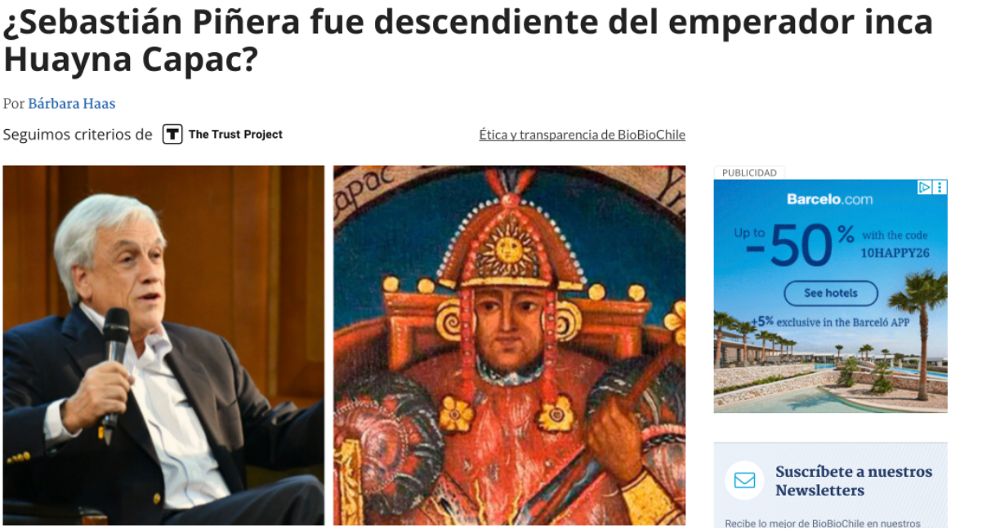
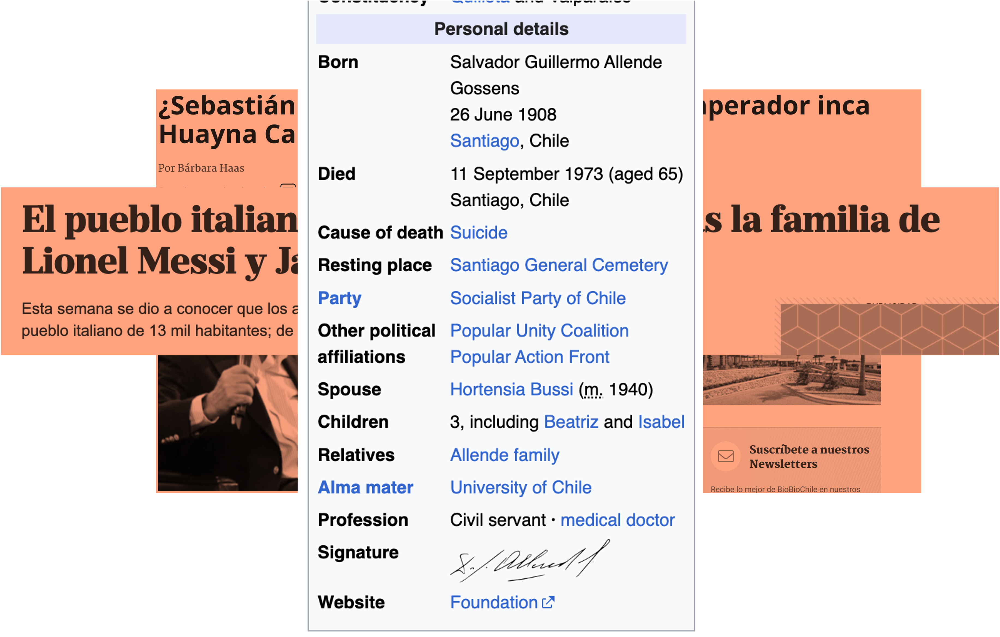

## 

## 

# Rastrear las familias de elite latinomericana desde los apellidos ¿Es eso posible?

# ¿Son los apellidos un demarcativo de las elites en Latinamérica?

## Why is impo

## .

{fig-align="center"}

# .

{fig-align="center"}

## .

{fig-align="center"}

## 
