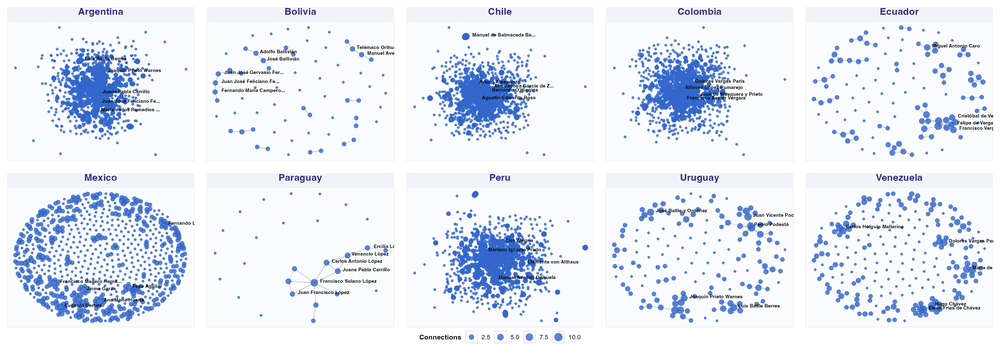
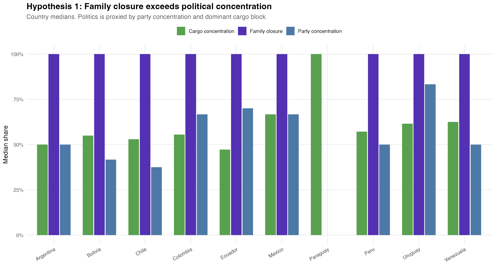
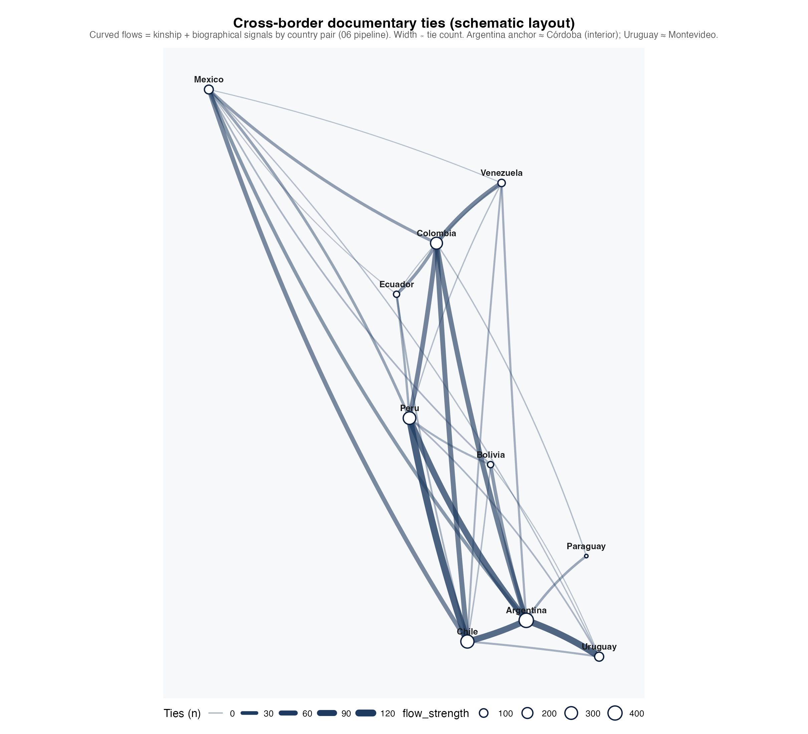
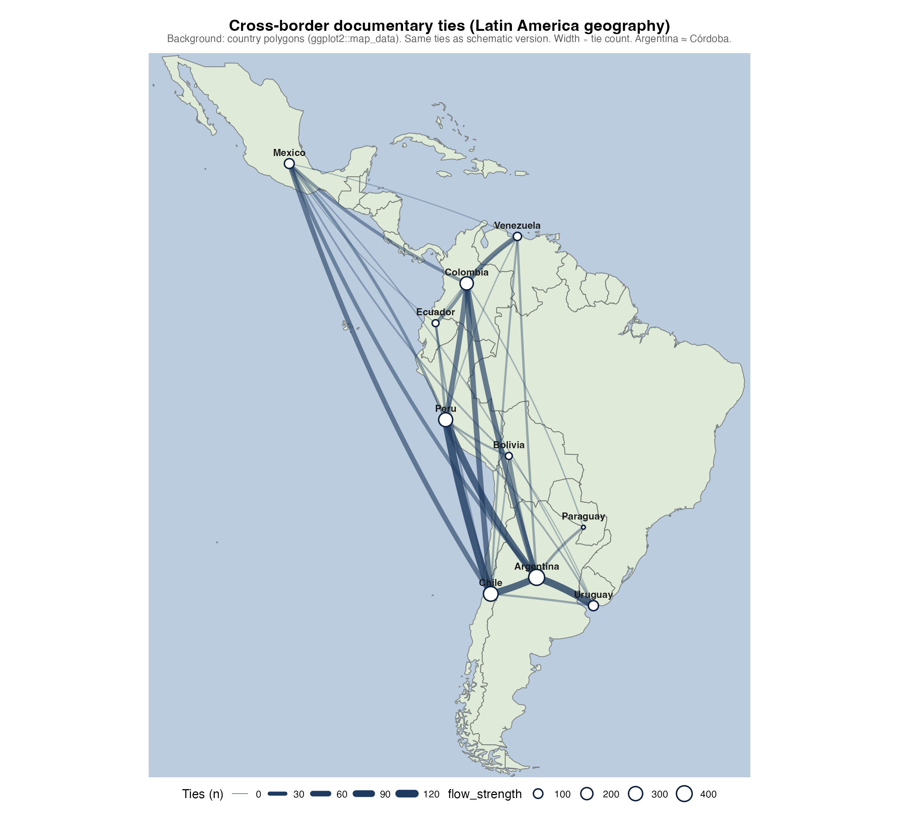
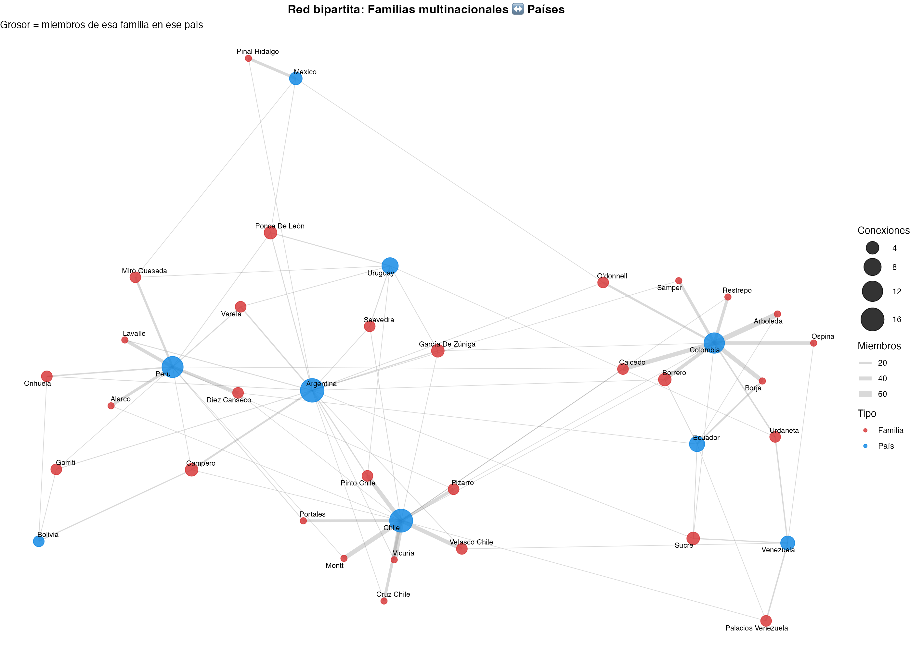

## 

## 

## The Central Question

::: columns
::: {.column width="60%"}
> **Do elite family networks structure political power reproduction in Latin America — and can we measure this at scale?**

-   Classical elite theory: *circulation* vs. *closure*
-   Empirical evidence at scale: scarce
-   Prosopographical reconstruction: labor-intensive, rarely cross-national

**This paper:** Wikipedia genealogical data as a computational social science resource
:::

::: {.column width="40%"}
{fig-align="center" width="100%"}

::: {style="font-size:0.45em; color:#60748e; text-align:center;"}
Piñera family — repeated elite surnames across Chilean politics
:::
:::
:::

------------------------------------------------------------------------

## Surnames as Elite Markers?

::: columns
::: {.column width="55%"}
**The sociological claim:**

In Latin America, surnames function as **social capital certificates** — encoding lineage, alliances, and institutional access across generations

-   Balmori, Voss & Wortman (1984): *familias notables* as unit of analysis
-   Bourdieu (1996): social reproduction through symbolic capital
-   Centeno (2002): elite networks and state formation

**The computational opportunity:**

Wikipedia infoboxes encode kinship ties at scale — and we can extract them
:::

::: {.column width="45%"}
{fig-align="center" width="100%"}

::: {style="font-size:0.45em; color:#60748e; text-align:center;"}
Cross-national elite connections: Chile–Argentina
:::
:::
:::

------------------------------------------------------------------------

## The Extended Network

{fig-align="center" width="75%"}

::: {style="font-size:0.5em; color:#60748e; text-align:center;"}
Elite kinship extending across political factions and historical periods — the same surnames reappear
:::

------------------------------------------------------------------------

## Data & Pipeline

::: columns
::: {.column width="50%"}
**Source:** Spanish-language Wikipedia (`es.wikipedia.org`)

**Extraction:** Infobox fields per person - `cónyuge`, `padres`, `hijos`, `pareja`, `hermanos` - `partido_político`, `educación` - `predecesor`, `sucesor` - Biographical text (first paragraph)

**Coverage:** - 10 countries: ARG, BOL, CHL, COL, ECU, MEX, PRY, PER, URY, VEN - **6,169 individuals** after deduplication - **8,201 matched kinship edges** (57.8% resolution rate) - 92.9% have parsed birth year
:::

::: {.column width="50%"}
**Processing pipeline:** Wikipedia scraping ↓ 00_consolidar_familias.R ↓ \_CONSOLIDADO_familias_latam.csv ↓ 02_leer_data.R → personas.rds relaciones.rds partidos.rds educacion.rds sucesiones.rds ↓ Network construction (igraph) ↓ Centrality + community detection
:::
:::

------------------------------------------------------------------------

## Two Key Conceptual Distinctions

::: {style="background:#f0f4ff; border-left:4px solid #5431b2; padding:0.6em 1em; margin-bottom:0.5em; border-radius:4px;"}
**① Closure–Reach Trade-off**

Families that maximize endogamy (*closure*) sacrifice bridging ties for transnational coordination. Families that maximize cross-border reach exhibit *lower* endogamy. These are **alternative strategies**, not complementary ones.
:::

::: {style="background:#f0f4ff; border-left:4px solid #315fbe; padding:0.6em 1em; border-radius:4px;"}
**② Documentary Elite Field**

Wikipedia encodes the stratum of families that successfully *inscribed themselves* in public digital archives. This is the object we analyze — its boundaries are a sociological datum, not merely a sampling limitation.

*We study who gets linked, not who actually ruled.*
:::

------------------------------------------------------------------------

## Four Hypotheses

|        | Hypothesis                                        | Mechanism                                               |
|--------------|---------------------------|-------------------------------|
| **H1** | Family closure ↔ political concentration          | Marriage market as political institution                |
| **H2** | Network topology ↔ regime type                    | Chain=patrimonial; Star=founding lineage; Web=oligarchy |
| **H3** | Transnational ties follow Pacific–Andean corridor | Colonial administrative geography                       |
| **H4** | Betweenness centrality = structural brokerage     | Multiplex positioning across kinship + institutions     |

: {tbl-colwidths="\[8,46,46\]"}

------------------------------------------------------------------------

## H2: Family Networks by Country

{.r-stretch fig-align="center"}

::: {style="font-size:0.48em; color:#60748e; text-align:center;"}
Node size = degree centrality. Color = family surname cluster. Each panel = one national kinship subgraph (Fruchterman-Reingold layout).
:::

------------------------------------------------------------------------

## H2: Four Topology Types

::: columns
::: {.column width="50%"}

**Chain** → Paraguay

:   López dynasty. Near-linear structure. Weber's patrimonialism.

**Star** → Chile, Peru

:   One super-hub (Balmaceda, colonial founding ancestor). Legitimacy through genealogy.
:::

::: {.column width="50%"}

**Dense Web** → Argentina, Colombia, Mexico

:   Multiple high-degree nodes. Competitive oligarchy. Rotation among peer families.

**Fragmented Clusters** → Bolivia, Venezuela, Ecuador

:   Isolated sub-networks. Regional caciquismo. Weak national elite integration.
:::
:::

::: {style="background:#f7f0ff; border-left:4px solid #5431b2; padding:0.5em 0.8em; margin-top:0.4em; border-radius:4px; font-size:0.7em;"}
**Interpretive claim:** Topology is not an artifact of corpus size — Paraguay's chain emerges from n=21, the smallest corpus. Bolivia and Ecuador fragment despite similar sizes. The pattern is structural.
:::

------------------------------------------------------------------------

## H1: Endogamy Rates by Country

::: columns
::: {.column width="55%"}
| Country   | Marriages | Endogamy rate | Transnational rate |
|-----------|-----------|---------------|--------------------|
| Paraguay  | 4         | **1.000**     | 0.000              |
| Ecuador   | 10        | 0.900         | 0.200              |
| Mexico    | 108       | 0.870         | 0.139              |
| Argentina | 177       | 0.864         | 0.203              |
| Venezuela | 25        | 0.840         | 0.200              |
| Chile     | 251       | 0.837         | 0.092              |
| Colombia  | 151       | 0.795         | 0.086              |
| Uruguay   | 18        | 0.778         | **0.389**          |
| Peru      | 104       | 0.769         | 0.115              |
| Bolivia   | 3         | 0.667         | 0.667              |
:::

::: {.column width="45%"}
**Key findings:**

-   Large political elites (Chile n=251, Argentina n=177) have *lower* endogamy
-   Uruguay: smallest elite, highest transnational rate (38.9%)
-   Paraguay: maximum closure = maximum political concentration

**The counter-intuitive result:** More connected families are *less* endogamous
:::
:::

------------------------------------------------------------------------

## H1: The Closure–Reach Trade-off

{.r-stretch fig-align="center"}

::: {style="font-size:0.48em; color:#60748e; text-align:center;"}
Corr(degree, closure): MEX −0.797 \| VEN −0.764 \| ARG −0.738 \| PER −0.720 \| CHL −0.536 \| COL −0.478. All negative, all large-n countries.
:::

------------------------------------------------------------------------

## H1: Mechanism

::: {style="font-size:0.78em;"}
**The structural logic:** In competitive oligarchic settings, access to state resources — contracts, appointments, fiscal transfers — required coalition partners drawn from *outside* one's own surname cluster.

Endogamy is a luxury of the **politically marginal**: families secure in their economic base (hacienda, mining, Church patronage) can forgo brokerage rents. High-degree families in our corpus are disproportionately *political* families — presidents, ministers, generals — whose positions required permanent negotiation with rival lineages.

This is the Padgett & Ansell (1993) logic applied to marriage markets: **"robust action" requires not over-committing to any single faction.**

**Critical distinction:**

-   `Corr(degree, closure)` strongly negative → marriage strategy drives reach
-   `Corr(betweenness, closure)` much weaker → institutional brokerage is independent of matrimonial closure

Two routes to elite power; two different network signatures.
:::

------------------------------------------------------------------------

## H3: Transnational Corridors

::: columns
::: {.column width="52%"}
**Top country pairs (kinship + biographical):**

| Pair                 | Kin | Bio | Total   |
|----------------------|-----|-----|---------|
| Chile → Peru         | 36  | 81  | **117** |
| Argentina → Uruguay  | 46  | 59  | **105** |
| Argentina → Chile    | 56  | 38  | **94**  |
| Argentina → Peru     | 31  | 59  | **90**  |
| Argentina → Colombia | 30  | 27  | 57      |
| Chile → Colombia     | 43  | 14  | 57      |

**Absent:** Argentina–Brazil (despite geographic scale)
:::

::: {.column width="48%"}
**The decomposition matters:**

-   Chile–Peru: 69% biographical → diplomatic/institutional
-   Argentina–Chile: 60% kinship → genealogical entanglement
-   Argentina–Uruguay: mixed → Rioplatense cultural field

**Not geography — colonial administrative units** structure the corridor
:::
:::

------------------------------------------------------------------------

## H3: Transnational Network

{.r-stretch fig-align="center"}

::: {style="font-size:0.48em; color:#60748e; text-align:center;"}
Edge width = total cross-border ties (kinship + biographical signals). Pacific–Andean corridor dominates. Argentina–Brazil absent.
:::

------------------------------------------------------------------------

## H3: Flow maps — schematic vs. geography

```{=html}
<div class="flow-map-row" style="display:flex;flex-direction:row;gap:0.6rem;width:100%;align-items:flex-start;justify-content:space-between;">
  <div style="flex:1 1 49%;min-width:0;max-width:50%;">
    
    <p style="font-size:0.38em;color:#60748e;text-align:center;margin:0.35em 0 0 0;line-height:1.25;">
      <strong>Left:</strong> schematic (plain background). Same tie weights; Argentina ≈ Córdoba.
    </p>
  </div>
  <div style="flex:1 1 49%;min-width:0;max-width:50%;">
    
    <p style="font-size:0.38em;color:#60748e;text-align:center;margin:0.35em 0 0 0;line-height:1.25;">
      <strong>Right:</strong> same ties on a Latin America basemap (<code>ggplot2::map_data</code>).
    </p>
  </div>
</div>
```

------------------------------------------------------------------------

## H3: Multinational Families

| Family        | Countries | Members | Geography          |
|---------------|-----------|---------|--------------------|
| Borrero       | 4         | 39      | ARG, CHL, COL, ECU |
| Campero       | 4         | 24      | ARG, BOL, CHL, PER |
| Ponce de León | 4         | 12      | ARG, MEX, PER, URY |
| Sucre         | 4         | 11      | ARG, COL, ECU, VEN |
| Pinto (Chile) | 3         | 50      | ARG, CHL, URY      |
| Caicedo       | 3         | 48      | CHL, COL, PER      |
| Pizarro       | 3         | 33      | CHL, COL, PER      |

: {tbl-colwidths="\[22,15,15,48\]"}

::: {style="font-size:0.65em; color:#304866; margin-top:0.4em;"}
Geographic footprints map onto **Bolivarian and Gran-Colombia political geographies** — consistent with post-independence elite continuity tied to colonial administrative networks.
:::

------------------------------------------------------------------------

## H3: Example — bipartite country–family network

{.r-stretch fig-align="center"}

::: {style="font-size:0.48em; color:#60748e; text-align:center;"}
Illustrative bipartite graph: countries and multinational families (cross-border elite structure).
:::

------------------------------------------------------------------------

## H4: Who Are the Brokers?

::: columns
::: {.column width="55%"}
| Name                  | Country   | Betweenness |
|-----------------------|-----------|-------------|
| Luis Felipe Villarán  | Peru      | 517,714     |
| Walter Humala         | Peru      | 473,134     |
| Luis Jaime Cisneros   | Peru      | 391,641     |
| José Evaristo Uriburu | Argentina | 328,970     |
| Pastor Obligado       | Argentina | 267,974     |
| Guido Di Tella        | Argentina | 240,510     |
| Cuauhtémoc Cárdenas   | Mexico    | 198,005     |
| Roque Sáenz Peña      | Argentina | 168,155     |
:::

::: {.column width="45%"}
**Peru dominates** — 3 of top 5. Lima's historical role as Viceregal hub: silver routes, revolutionary circuits, post-war documentation.

**Argentina's Generation of 1880** — Uriburu, Obligado, Sáenz Peña: simultaneously built the state, a party system, and a marriage market in Buenos Aires.
:::
:::

------------------------------------------------------------------------

## Gender Patterns

::: columns
::: {.column width="55%"}
**Exploratory finding** (name-heuristic):

-   Women: **high degree** in kinship-only graph
-   Women: **lower betweenness** in multiplex graph

**Lavrin (1990):** marriage as alliance

**Bourdieu (1996):** genealogical visibility ≠ institutional brokerage
:::

::: {.column width="45%"}
::: {style="background:#fff8f0; border:1px solid #f0c080; border-radius:6px; padding:0.6em; font-size:0.68em;"}
**Argentina top connectors:**

Agustina Ortiz de Rozas, Agustina López de Osornio, Ana Jacoba García de Z., María de los Remedios...

Women = top-degree nodes in kinship graph — but absent from betweenness ranking.

**The degree–betweenness split:** genealogical connectors vs. institutional brokers.
:::
:::
:::

------------------------------------------------------------------------

## Competing Explanations

::: {style="font-size:0.78em;"}
**① Wikipedia visibility bias** — *Concern:* High degree = celebrity not structure. *Response:* Negative Corr(degree, closure) cannot follow from visibility alone. Topology variation across countries uses the same corpus.

**② Demographic structure** — *Concern:* Larger countries = denser networks. *Response:* Chile (dense star) has half Mexico's population. Paraguay's chain = n=21, smallest corpus. Size ≠ topology.

**③ Random network formation** — *Concern:* Patterns indistinguishable from random. *Response:* A random graph with Chile's degree sequence would not produce a star. Star formation requires preferential attachment or founding-lineage mechanism. Future ERGMs can formalize this.
:::

------------------------------------------------------------------------

## Toward Causal Identification

::: {style="font-size:0.76em;"}
**① Cohort analysis** — 92.9% have birth years. Slicing by birth decade tests whether closure–reach trade-off intensified during state consolidation (1833 Chilean Constitution) and relaxed during revolutionary disruptions (1891 Civil War).

**② War of the Pacific as natural experiment** — 1879–84 exogenous shock to Chilean–Peruvian elite relations. DiD design: Treatment = Chile–Peru edges pre/post-1879. Control = Argentina–Uruguay (no equivalent shock). Test: is biographical-heavy Chile–Peru a post-war documentary artifact?

**③ Geographic constraints as instruments** — Andes create differential travel costs. City pairs at similar distances but separated by different geographic barriers should show different kinship edge densities — partially identifying the corridor effect.
:::

------------------------------------------------------------------------

## Broader Implications

::: {style="background:#f0f4ff; border-left:4px solid #5431b2; padding:0.6em 1em; margin-bottom:0.4em; border-radius:4px; font-size:0.74em;"}
**Democracy:** Where closure and institutional concentration coincide, democratic accountability faces a structural obstacle. The same families occupy political, judicial, educational, and economic positions simultaneously. This is not corruption — it is *architecture*.
:::

::: {style="background:#f0fff4; border-left:4px solid #1a7a4a; padding:0.6em 1em; margin-bottom:0.4em; border-radius:4px; font-size:0.74em;"}
**Computational Social Science:** Wikipedia genealogical data is an underused resource. 57.8% kinship resolution rate + 92.9% birth year coverage = large-scale prosopography without archival heroism.
:::

::: {style="background:#fff8f0; border-left:4px solid #c07030; padding:0.6em 1em; border-radius:4px; font-size:0.74em;"}
**Digital Archives:** Elite families most densely inscribed in Wikipedia are most vulnerable to network-based accountability journalism. Open genealogical data may paradoxically reinforce elite salience by making visible what previously required archival access.
:::

------------------------------------------------------------------------

## Summary

::: columns
::: {.column width="50%"}
**What we did:**

-   Wikipedia kinship scraping, 10 countries
-   Multiplex network: kinship + party + university + succession
-   6,169 individuals · 8,201 matched edges
-   4 hypotheses: closure, topology, corridors, brokerage

**Two new concepts:**

-   *Closure–reach trade-off*
-   *Documentary elite field*
:::

::: {.column width="50%"}
**What we found:**

-   [x] H1: Degree–closure **negative** everywhere (−0.53 to −0.80)
-   [x] H2: Topology maps onto stylized regime types
-   [x] H3: **Pacific–Andean corridor** dominates
-   [x] H4: Peru + Argentina dominate brokerage
-   ➕ Gender: degree–betweenness split

**Main claim:**

> *Family network structure is not a byproduct of political order in Latin America — it is a constitutive infrastructure of it.*
:::
:::

------------------------------------------------------------------------

##  {#thank-you-slide}

::: thank-you-content
### Thank you!

**Elite Family Networks in Latin America**

*Evidence from Wikipedia Genealogical Data*

**Matías Deneken**

*PhD Computational Social Science (Accepted)*

*London School of Economics*

[m.deneken\@uc.cl](mailto:m.deneken@uc.cl){.email-link}

[GitHub: \@matdknu](https://github.com/matdknu){.github-link}
:::
